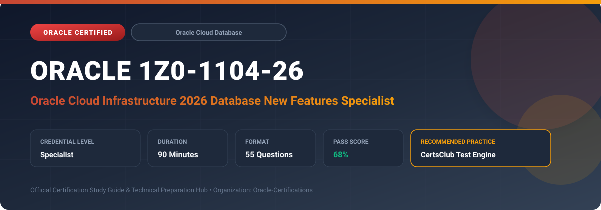

  

# Oracle 1Z0-1104-26: Oracle Cloud Infrastructure 2026 Database New Features Specialist

---

## 1. Exam Overview & Candidate Profile

The **Oracle 1Z0-1104-26: Oracle Cloud Infrastructure 2026 Database New Features Specialist** exam certifies deep proficiency in the latest architectural features across OCI Database services and Oracle Database 23ai.

Candidates prove their knowledge in AI Vector Search, JSON-Relational Duality views, globally distributed databases (Raft replication), True Cache, Autonomous Database innovations, and Exadata Cloud infrastructure updates.

### Target Audience & Prerequisites
- **Target Roles**: Implementation Specialists, Cloud Architects, Technical Leads, Enterprise Consultants, and Systems Engineers.
- **Recommended Experience**: 1–2 years of practical, hands-on experience designing, implementing, and maintaining corresponding Oracle solutions.
- **Credential Earned**: Specialist Certification.

---

## 2. Key Exam Specifications

| Specification | Details |
| :--- | :--- |
| **Exam Code** | **Oracle 1Z0-1104-26** |
| **Official Title** | Oracle Cloud Infrastructure 2026 Database New Features Specialist |
| **Certification Track** | Oracle Cloud Database |
| **Exam Duration** | 90 Minutes |
| **Number of Questions** | 55 Questions |
| **Passing Score** | 68% |
| **Question Format** | Multiple Choice (Single/Multiple Answer), Scenario-Based Questions |
| **Delivery Provider** | Oracle University / Pearson VUE (Online Proctored or Test Center) |
| **Recommended Practice Engine** | [CertsClub Oracle Practice Tests](https://www.certsclub.com/oracle/1z0-1104-26-dumps.html) |

---

## 3. Official Blueprint & Exam Domain Breakdown

The examination assesses candidate competencies across core functional domains weighted as follows:

| Domain Area | Weighting |
| :--- | :--- |
| **Oracle Database 23ai Core Architectural Enhancements** | `30%` |
| **AI Vector Search & Embeddings in OCI Database** | `25%` |
| **JSON-Relational Duality & Developer Productivity Features** | `20%` |
| **Autonomous Database Innovations & Serverless Scaling** | `15%` |
| **High Availability, True Cache & Exadata Enhancements** | `10%` |

---

## 4. Deep Dive into Complex & Challenging Technical Topics

To secure a passing score on the 1Z0-1104-26 exam, candidates must master the following advanced concepts:

- Architecting AI Vector Search with VECTOR data types, in-memory neighbor graph indexes (HNSW, IVF), and distance metrics.
- Implementing JSON-Relational Duality views for schema flexibility with transactional ACID guarantees.
- Deploying Oracle True Cache to scale read-intensive transactional workloads transparently.
- Managing Globally Distributed Database with Raft replication for zero data loss active-active architectures.
- Autonomous Database automated elastic scaling, auto-provisioning, and cross-cloud Data Guard.

---

## 5. Scenario-Based Demo & Practice Questions

### Question 1
Which Oracle Database 23ai feature provides developers with the flexibility of storing and retrieving document-oriented JSON objects while maintaining full relational ACID consistency and normalization under the hood?

A) JSON-Relational Duality Views
B) Oracle XML DB Repositories
C) External Partitioned Tables
D) Hybrid Columnar Compression

- **Correct Answer**: `A) JSON-Relational Duality Views`  
- **Technical Explanation**: JSON-Relational Duality Views allow data to be stored relationally while being accessed and manipulated as JSON documents, providing the benefits of both document and relational paradigms.

---

### Question 2
What index structure is recommended in Oracle Database 23ai AI Vector Search when ultra-fast similarity search recall is required across millions of high-dimensional vectors?

A) Hierarchical Navigable Small World (HNSW) Vector Index
B) B-Tree Composite Index
C) Bitmap Join Index
D) Reverse Key Index

- **Correct Answer**: `A) Hierarchical Navigable Small World (HNSW) Vector Index`  
- **Technical Explanation**: HNSW (Hierarchical Navigable Small World) is an approximate nearest neighbor graph-based index optimized for high-dimensional vector search with outstanding recall and query speed.

---

## 6. Recommended Preparation Strategy & Practice Testing Engine

Achieving certification in **Oracle 1Z0-1104-26** requires balanced theoretical study and scenario-based simulation practice:

1. **Review Oracle Documentation**: Master architecture guides, implementation workbooks, and administration manuals on the Oracle Help Center.
2. **Hands-on Lab Practice**: Execute real-world configuration, policy setup, and troubleshooting tasks in your cloud tenancy or test instance.
3. **Simulated Exam Drills**: Practice answering timed, scenario-based multiple-choice questions to familiarize yourself with the question formats, traps, and timing constraints.

### Practice With CertsClub
For realistic practice questions, updated dumps, and mock testing environments:
- **Resource**: [CertsClub Oracle Practice Test Engine](https://www.certsclub.com/oracle/1z0-1104-26-dumps.html)
- **Special Discount**: Use coupon code **`club20`** during checkout for an instant **20% discount** on all practice exam bundles and testing engines.

---

## 7. Official Documentation & References

- [Oracle University Certification Registry](https://education.oracle.com/)
- [Oracle Help Center Documentation Portal](https://docs.oracle.com/)
- [Oracle Cloud Infrastructure & Applications Guides](https://docs.oracle.com/en/cloud/)
- [CertsClub Oracle Certification Exam Practice](https://www.certsclub.com/oracle/1z0-1104-26-dumps.html)

---

## 8. SEO & Discovery Keywords

`oracle 1z0-1104-26, oracle 1z0-1104-26 exam, oracle 1z0-1104-26 dumps, 1Z0-1104-26 practice questions, 1Z0-1104-26 study guide, oracle cloud infrastructure 2026 database new features specialist, certsclub 1z0-1104-26`